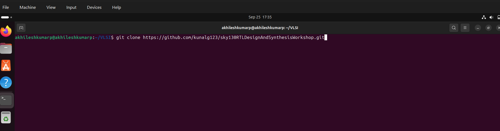
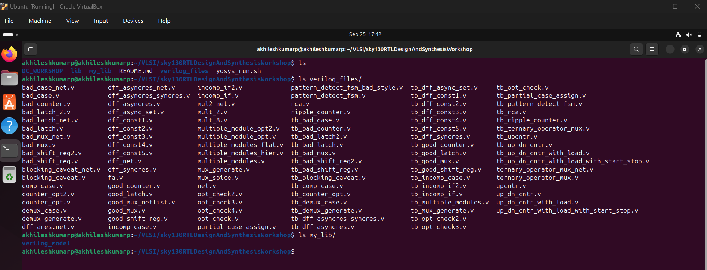
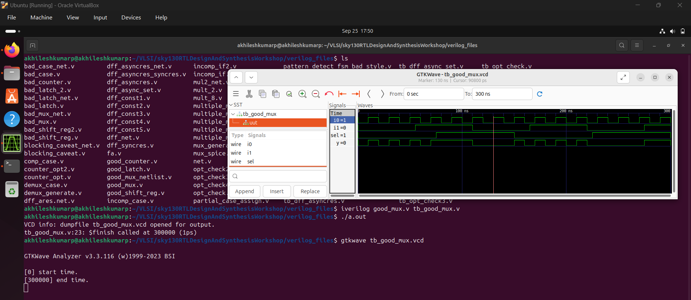
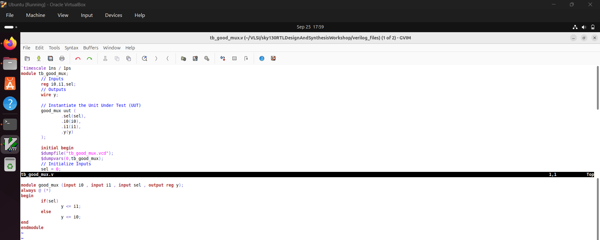
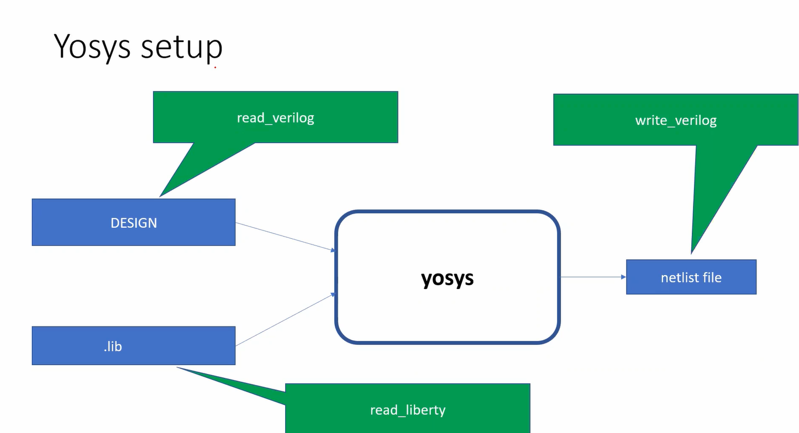
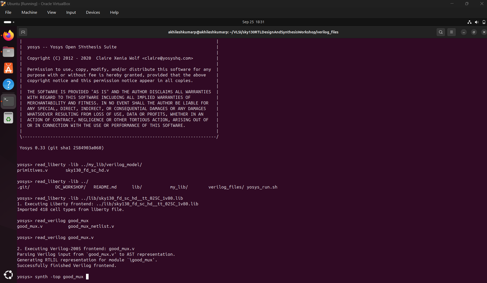
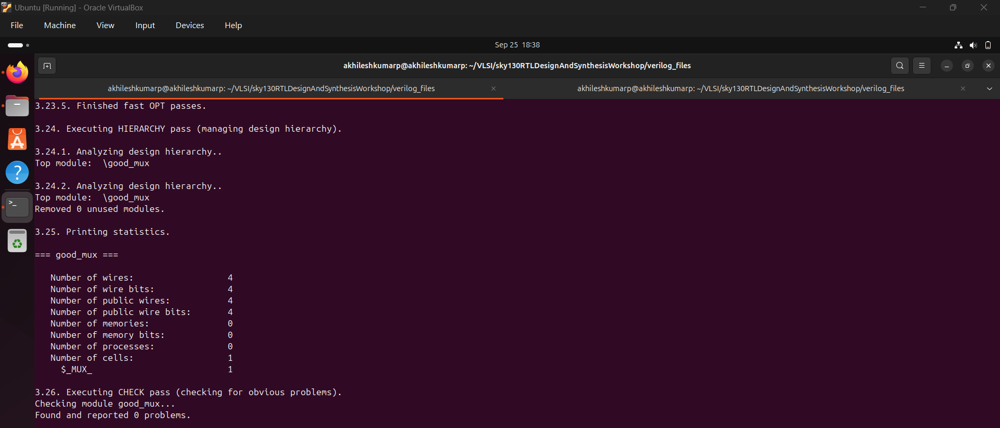
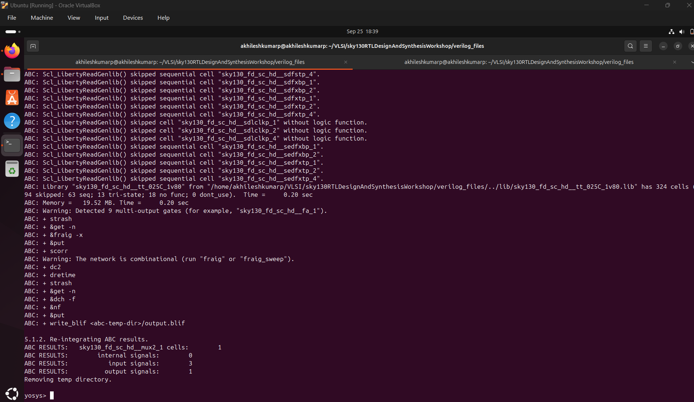
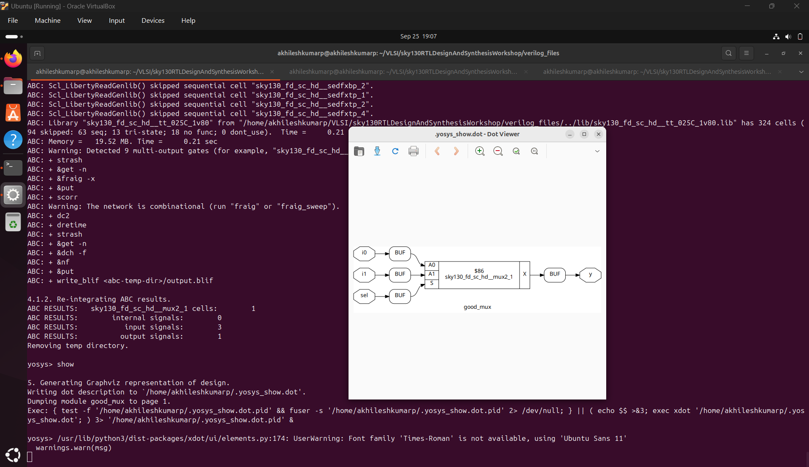
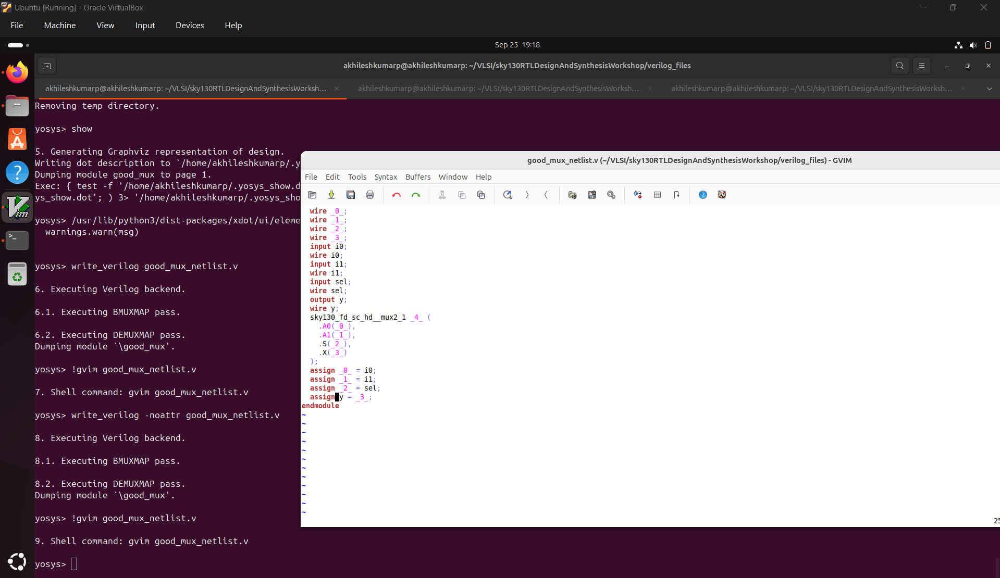

Day1:

Introduction to Verilog design and synthesis.

Introduction to open-source simulator iverilog     
2-SKY130RTL D1SK1 L1 Introduction to iverilog design test bench
Simulator: It is a tool/program which detects the changes in the inputs and forms changes in the output.
given below a look of a basic simulator block diagram.

given bleow the flow of iverilog and gtkwave.

LABS: 
Labs using Iverilog and GTKWave.
3-SKY130RTL D1SK2 L1 Lab1 introduction to lab
step1: clone repo files for labs by command: git clone https://github.com/kunalg123/sky130RTLDesignAndSynthesisWorkshop.git

4-SKY130RTL D1SK2 L2 Lab2 Introduction iverilog gtkwave part1
Simulate a good_mux using iverlog and view and analyze the waveform using gtkwave tool.

5-SKY130RTL D1SK2 L3 Lab2 Introduction iverilog gtkwave part2

Introduction to Yosys and logic synthesis
6-SKY130RTL D1SK3 L1 Introduction to yosys
Synthesizer: used to convert RTL logic to netlist.

Verify the synthesis by simulation of netlist with the tb, match the results of both behavioural and netlist simulation runs with the same testbench code. 

7-SKY130RTL D1SK3 L2 introduction to logic synthesis part1
RTL is written in verlog HDL.
we need a digital circuit made of hardware circuit. 
The key is synthesis, design is converted to the gate level netlist. 
A .lib is a collectiono of logic modules such as AND, OR, XOR with different speed or types.
Why need different flavours of gates: 
Because of the setup and hold issues.

8-SKY130RTL D1SK3 L3 introduction to logic synthesis part2
Need to guide the synthsize to select the best logical cells that is ideal for the logic circuit.
balance between power performance and are. 
the guidance can be given to the synthesis tool in the form of constraints file. 

Labs using Yosys and Sky130PDKs
9-SKY130RTL D1SK4 L1 Lab3 Yosys 1 good mux Part1
read .lib 
read verilog 
synth -top module_name

10-SKY130RTL D1SK4 L2 Lab3 Yosys 1 good mux Part2
Analyse the synthesized image. 

11-SKY130RTL D1SK4 L3 Lab3 Yosys 1 good mux Part3
