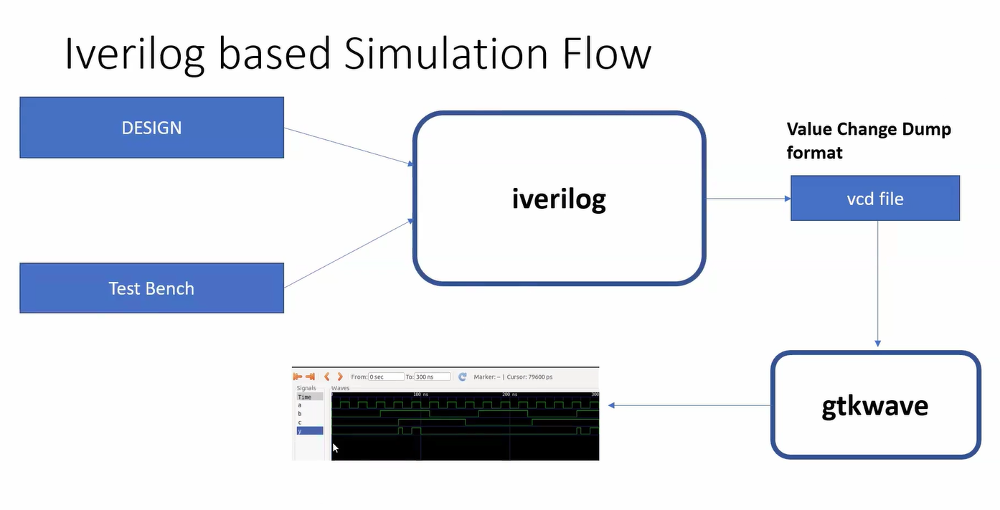

Day1:

Introduction to Verilog design and synthesis.

Theory:
2-SKY130RTL D1SK1 L1 Introduction to iverilog design test bench
Simulator: It is a tool/program which detects the changes in the inputs and forms changes in the output.
given below a look of a basic simulator block diagram.

given bleow the flow of iverilog and gtkwave.

LABS: 
Labs using Iverilog and GTKWave.

3-SKY130RTL D1SK2 L1 Lab1 introduction to lab
4-SKY130RTL D1SK2 L2 Lab2 Introduction iverilog gtkwave part1
5-SKY130RTL D1SK2 L3 Lab2 Introduction iverilog gtkwave part2

Introduction to Yosys and logic synthesis
6-SKY130RTL D1SK3 L1 Introduction to yosys
7-SKY130RTL D1SK3 L2 introduction to logic synthesis part1
8-SKY130RTL D1SK3 L3 introduction to logic synthesis part2

Labs using Yosys and Sky130PDKs
9-SKY130RTL D1SK4 L1 Lab3 Yosys 1 good mux Part1
10-SKY130RTL D1SK4 L2 Lab3 Yosys 1 good mux Part2
11-SKY130RTL D1SK4 L3 Lab3 Yosys 1 good mux Part3