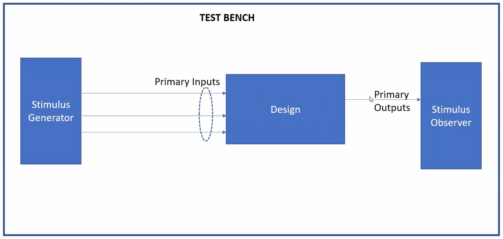

Day1 Introduction to Verilog design and synthesis.

Simulator is a tool/program which detects the changes in the inputs and forms changes in the output.

given below a look of a basic simulator block diagram.

given bleow the flow of iverilog and gtkwave.

