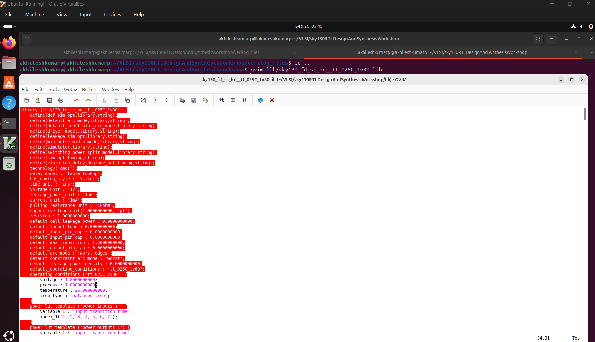
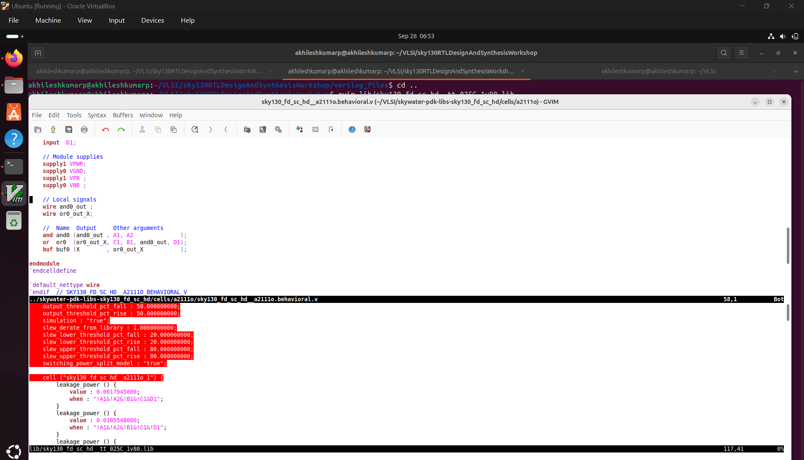
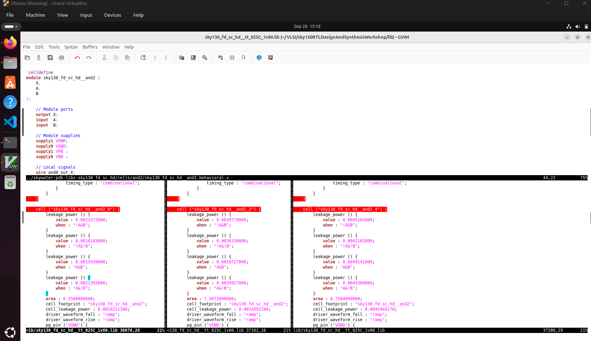
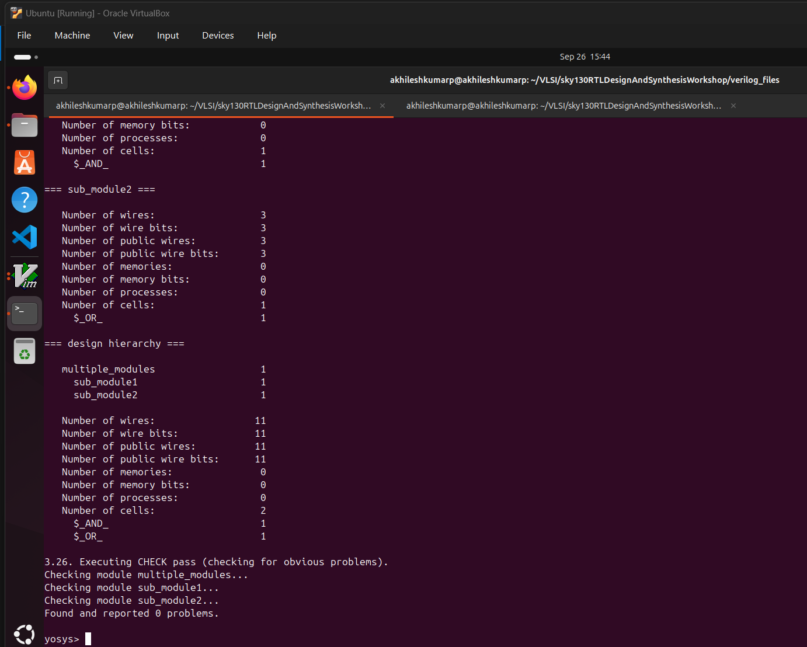
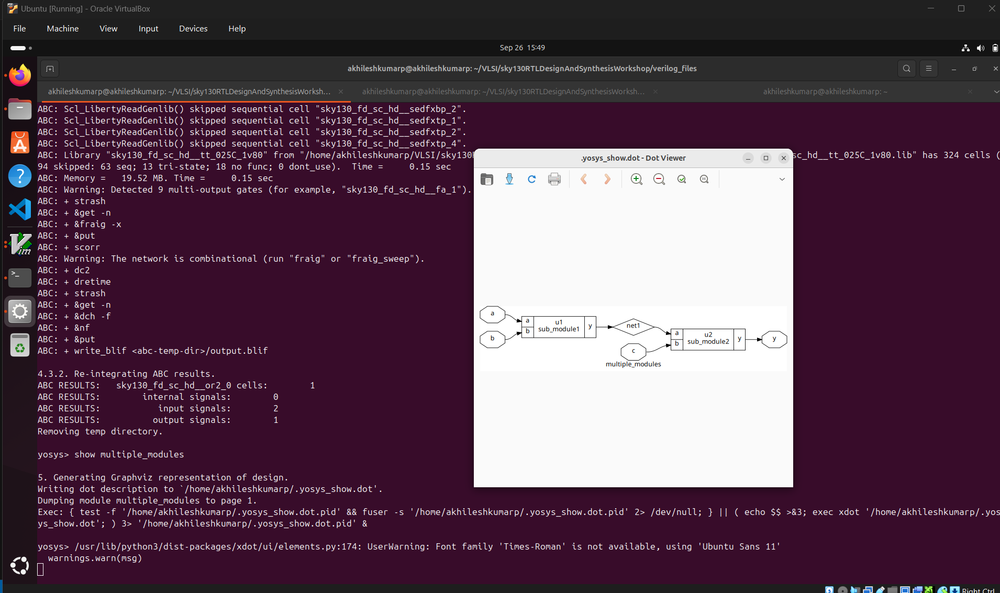

Day2: 
Timing libs, hierarchical vs flat synthesis and efficient flop coding styles.

Introduction to timing .libs
12-SKY130RTL D2SK1 L1 Lab4 Introduction to dot Lib part1
Image shows the .lib file of the sky130 which shows the various parameters of the library file.

The libraries can be either slow, typical or fast, the above shown .lib is a typical lib.
.lib takes consideration of the PVT corners, 
P-> Process :variation due to process related change.
V-> Voltage :variation due to voltage changes.
T-> Temperature :variation due to temp changes.

13-SKY130RTL D2SK1 L2 Lab4 Introduction to dot Lib part2

The file says what is the power, input cap, delay etc associated with the particular component at differnt configurations.

more info on the sky130_fd_sc_hd can be found at repo: https://github.com/google/skywater-pdk-libs-sky130_fd_sc_hd

14-SKY130RTL D2SK1 L3 Lab4 Introduction to dot Lib part3

we can see the delay area and power changes across three different and gates shown in the above image.

Hierarchical and Flat synthesis
15-SKY130RTL D2SK2 L1 Lab05 Hier synthesis flat synthesis part1
The file we considering is multiple_modules.v file as shown below

launch yosys -> read liberty file -> Read multiple_modules.v -> synthesize top multiple_modules

16-SKY130RTL D2SK2 L2 Lab05 Hier synthesis flat synthesis part2

Various flop coding styles and optimization
17-SKY130RTL D2SK3 L1 Why Flops and Flop coding styles part1
18-SKY130RTL D2SK3 L2 Why Flops and Flop coding styles part2
19-SKY130RTL D2SK3 L3 Lab flop synthesis simulations part1
20-SKY130RTL D2SK3 L4 Lab flop synthesis simulations part2
21-SKY130RTL D2SK3 L5 Interesting optimisations part1
22-SKY130RTL D2SK3 L6 Interesting optimisations part2