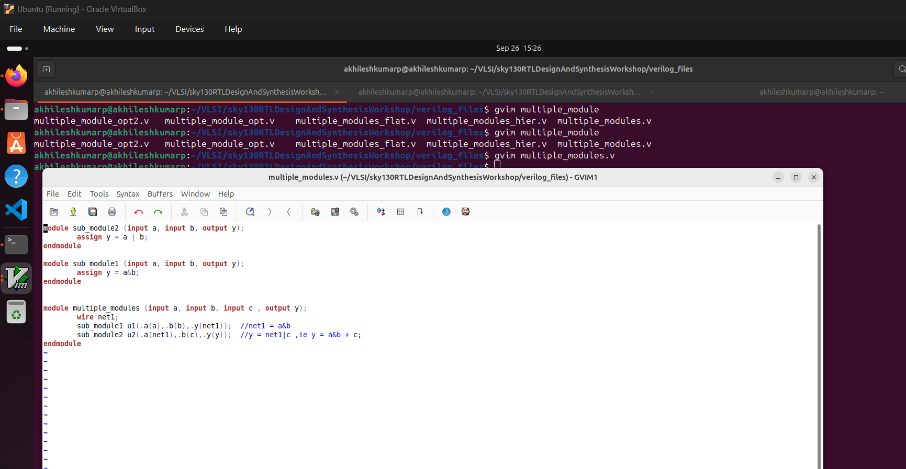

Day2: 
Timing libs, hierarchical vs flat synthesis and efficient flop coding styles.

Introduction to timing .libs
12-SKY130RTL D2SK1 L1 Lab4 Introduction to dot Lib part1
Image shows the .lib file of the sky130 which shows the various parameters of the library file.

The libraries can be either slow, typical or fast, the above shown .lib is a typical lib.
.lib takes consideration of the PVT corners, 
P-> Process :variation due to process related change.
V-> Voltage :variation due to voltage changes.
T-> Temperature :variation due to temp changes.

13-SKY130RTL D2SK1 L2 Lab4 Introduction to dot Lib part2

The file says what is the power, input cap, delay etc associated with the particular component at differnt configurations.

more info on the sky130_fd_sc_hd can be found at repo: https://github.com/google/skywater-pdk-libs-sky130_fd_sc_hd

14-SKY130RTL D2SK1 L3 Lab4 Introduction to dot Lib part3

we can see the delay area and power changes across three different and gates shown in the above image.

Hierarchical and Flat synthesis
15-SKY130RTL D2SK2 L1 Lab05 Hier synthesis flat synthesis part1
The file we considering is multiple_modules.v file as shown below

launch yosys -> read liberty file -> Read multiple_modules.v -> synthesize top multiple_modules

-> once we see the result using show command we can see that its in hierarchical model where we do not see it as AND gate, OR gate, instead we just see as module1 and module2 as seen below.

-> write the contents to a verilog file called multiple_modules_hierarchical.v

Because of the stacked PMOS problem on the NOR+NOT config the synthesis tool is optimized to choose the NAND + NOT gates to reduce the PMOS stack, thereby increasing mobility and overall effective circuit.

16-SKY130RTL D2SK2 L2 Lab05 Hier synthesis flat synthesis part2
When we use the command "flatten" on yosys terminal, it flattens the design 
write the design to multiple_modules_flatten.v
and now we can see that it is composed of gates

two main reasons why we do this 
1.Module level synthesis is prefered when we have multiple instances of the same module.
2.Divide a huge design to multiple sub modules to tackle big design.

Various flop coding styles and optimization

17-SKY130RTL D2SK3 L1 Why Flops and Flop coding styles part1
Lets see different styles of coding flops and types of flops available. 
-> with just combinational circuits the propagation delay adds glitches to the signal, to prevent it with the proper timing sequence we use flops.
flops are used in combinational path as a glitch filters, with sync/async resets/ initializations with proper values to prevent glitch insertions.

18-SKY130RTL D2SK3 L2 Why Flops and Flop coding styles part2
Figure below shows a flop with async reset. 

comparing with the async set we can see below async set.

19-SKY130RTL D2SK3 L3 Lab flop synthesis simulations part1

20-SKY130RTL D2SK3 L4 Lab flop synthesis simulations part2

21-SKY130RTL D2SK3 L5 Interesting optimisations part1

22-SKY130RTL D2SK3 L6 Interesting optimisations part2

