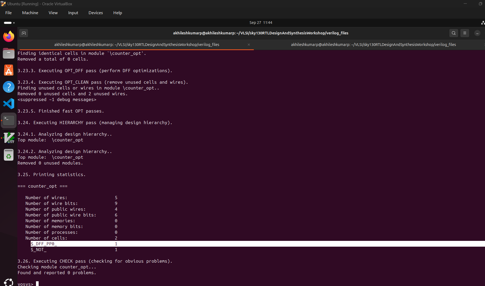

Day3:
Combinational and sequential optimizations.

Introduction to optimizations.
23-SKY130RTL D3SK1 L1 Introduction to optimisations part1

24-SKY130RTL D3SK1 L2 Introduction to optimisations part2
sequential logic optimizations.

25-SKY130RTL D3SK1 L3 Introduction to optimisations part3
more explination about logic optimization.

Combinational logic optimizations.
26-SKY130RTL D3SK2 L1 Lab06 Combinational Logic Optimisations part1

27-SKY130RTL D3SK2 L2 Lab06 Combinational Logic Optimisations part2

Sequential logic optimizations.
28-SKY130RTL D3SK3 L1 Lab07 Sequential Logic Optimisations part1

29-SKY130RTL D3SK3 L2 Lab07 Sequential Logic Optimisations part2

30-SKY130RTL D3SK3 L3 Lab07 Sequential Logic Optimisations part3

Sequential logic optimization for unused outputs.

31-SKY130RTL D3SK4 L1 Seq optimisation unused outputs part1

32-SKY130RTL D3SK4 L2 Seq optimisation unused outputs part2