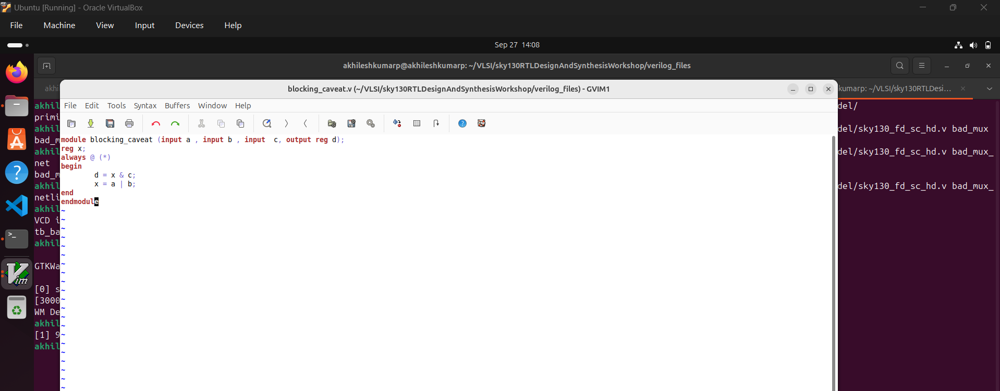
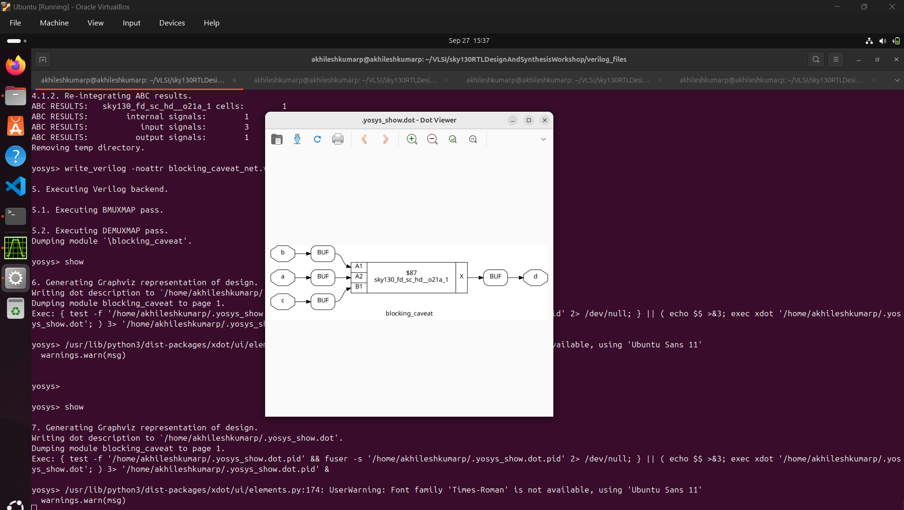

Day4:
GLS, blocking vs non-blocking and Synthesis-Simulation mismatch.

GLS, Synthesis-Simulation mismatch and Blocking/Non-blocking statements
33-SKY130RTL D4SK1 L1 GLSConceptsAndFlowUsingIverilog

34-SKY130RTL D4SK1 L2 SynthesisSimulationMismatch
precationary measures to take care in sensitivity list etc. 

35-SKY130RTL D4SK1 L3 BlockingAndNonBlockingStatementsInVerilog
Blocking and non blocking statemetns, caviats in Blocking statements.

36-SKY130RTL D4SK1 L4 CaveatsWithBlockingStatements
caveats with blocking statemetns in depth 

Labs on GLS and Synthesis-Simulation mismatch
37-SKY130RTL D4SK2 L1 Lab GLS Synth Sim Mismatch part1

38-SKY130RTL D4SK2 L2 Lab GLS Synth Sim Mismatch part2

Labs on synth-sim mismatch for blocking statement
39-SKY130RTL D4SK3 L1 Lab Synth sim mismatch blocking statement part1

40-SKY130RTL D4SK3 L2 Lab Synth sim mismatch blocking statement part2

