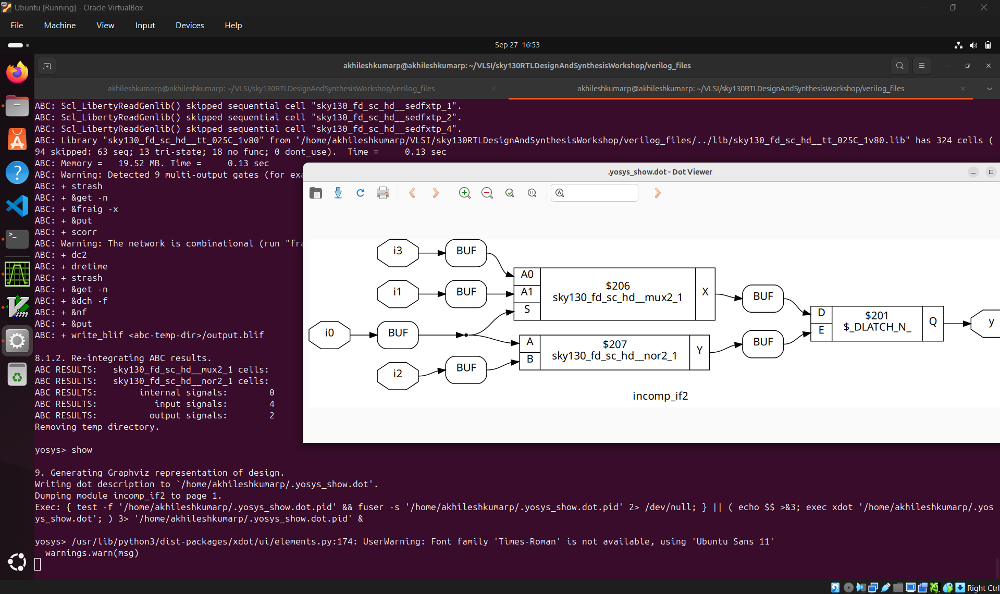

Day5:
Optimization in synthesis.

If Case constructs.
41-SKY130RTL D5SK1 L1 IF CASE Constructs part1

42-SKY130RTL D5SK1 L2 IF CASE Constructs part2

43-SKY130RTL D5SK1 L3 IF CASE Constructs part3

Labs on "Incomplete If Case"
44-SKY130RTL D5SK2 L1 Lab Incomplete IF part1

45-SKY130RTL D5SK2 L2 Lab Incomplete IF part2

Labs on "Incomplete overlapping Case"

46-SKY130RTL D5SK3 L1 Lab incomplete overlapping Case part1

47-SKY130RTL D5SK3 L2 Lab incomplete overlapping Case part2

48-SKY130RTL D5SK3 L3 Lab incomplete overlapping Case part3

49-SKY130RTL D5SK3 L4 Lab incomplete overlapping Case part4

for loop and for generate.

50-SKY130RTL D5SK4 L1 For Loop and For Generate part1

51-SKY130RTL D5SK4 L2 For Loop and For Generate part2

52-SKY130RTL D5SK4 L3 For Loop and For Generate part3

Labs on "for loop" and "for generate"
53-SKY130RTL D5SK5 L1 Lab For and For Generate part1

54-SKY130RTL D5SK5 L2 Lab For and For Generate part2

55-SKY130RTL D5SK5 L3 Lab For and For Generate part3

56-SKY130RTL D5SK5 L4 Lab For and For Generate part4